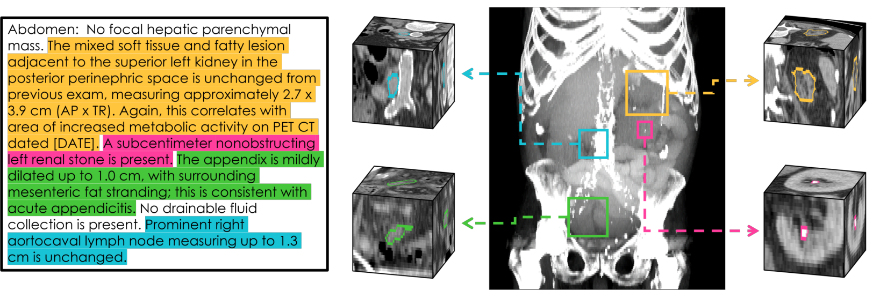
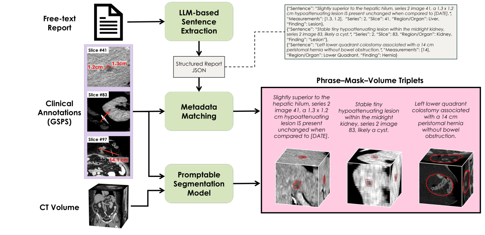

# LocusCT: Scaling 3D Visual Grounding in Abdominal CT

**Grounding radiology report findings in 3D CT, trained on routine radiologist annotations.**

[Paper (coming soon)](#) · [Weights (coming soon)](#) · [LocusBench (coming soon)](#)

<p align="center">
  
</p>

Radiologists routinely place measurement lines and arrows on CT images, and PACS stores them as DICOM GSPS objects. We link these annotations to their report sentences and convert them into 3D masks with [SAM2CT](https://arxiv.org/abs/2602.00309). This yields **105K phrase–mask–volume triplets** from 59K abdominal CT exams without any extra annotation. On this data we train **LocusCT**, and we introduce **LocusBench**, a radiologist-verified benchmark of 240 oncology findings (Onc) and 260 emergency-department findings across 13 categories (ED).

<p align="center">
  
</p>

## Results

| Model | Onc Dice | Onc Hit Rate | ED Dice | ED Hit Rate |
|---|---:|---:|---:|---:|
| SegVol | 0.015 | 0.044 | 0.016 | 0.037 |
| BiomedParse-v2 | 0.065 | 0.158 | 0.067 | 0.182 |
| VoxTell | 0.117 | 0.188 | 0.118 | 0.209 |
| **LocusCT** | **0.495** | **0.725** | **0.490** | **0.773** |

Hit rate is the fraction of cases with Dice ≥ 0.1. Baselines are zero-shot. See the paper for ablations and the external evaluation on Merlin.

## Installation

```bash
git clone https://github.com/samdchurch/LocusCT.git
cd LocusCT
pip install -r requirements.txt
```

LocusCT uses the [VoxTell](https://github.com/MIC-DKFZ/VoxTell) architecture. Download the `voxtell_v1.1` release into `voxtell/voxtell_v1.1/`. Only its `plans.json` is read when training from scratch. The frozen text encoder is [Qwen3-Embedding-4B](https://huggingface.co/Qwen/Qwen3-Embedding-4B). If you prefer a container, an Apptainer definition is provided in `grounder.def`.

## Evaluate on LocusBench

First resample LocusBench to 1.5 × 1.5 × 3.0 mm:

```bash
python scripts/data_prep/resample_locusbench.py \
    --locusbench-root /path/to/LocusBench --output-root /path/to/data --split both
```

Then score a checkpoint:

```bash
python scripts/evaluation/evaluate_finetuned_voxtell_ed.py \
    --checkpoint /path/to/locusct.pt \
    --manifest /path/to/LocusBench/LocusBench-ED/LocusBench-ED.json \
    --image-dir /path/to/data/LocusBench-ED_resampled \
    --mask-dir  /path/to/data/LocusBench-ED_resampled \
    --text-encoder Qwen/Qwen3-Embedding-4B \
    --multi-window \
    --output outputs/locusbench_ed/results.json
```

For the Onc split, use `evaluate_finetuned_voxtell_onc.py` with the matching paths. Add `--save-masks` to write the predicted masks as NIfTI files.

## Train

Training data is a JSON manifest of `{"image", "mask", "sentence"}` entries, with images and masks resampled to 1.5 × 1.5 × 3.0 mm.

```bash
torchrun --nproc_per_node=4 finetune_voxtell.py \
    --from-scratch \
    --train-manifest train.json --val-manifest val.json \
    --image-dir /path/to/images --mask-dir /path/to/masks \
    --text-encoder Qwen/Qwen3-Embedding-4B \
    --batch-size 3 --lr 3e-5 --warmup-epochs 0 \
    --output-dir runs/locusct
```

Two notes on the code:

- The SLURM launchers for every experiment in the paper are in `submission_scripts/`.
- `Grounder` (`train.py`) is the ConTEXTual Net 3D variant we compared against.

## Citation

```bibtex
@article{church2026locusct,
  title   = {Scaling 3D Visual Grounding in Abdominal CT},
  author  = {Church, Samuel and Warner, Joshua D. and Voter, Andrew F. and Maqbool, Danyal and Hu, Junjie and Lubner, Meghan G. and Bradshaw, Tyler J.},
  journal = {arXiv preprint arXiv:XXXX.XXXXX},
  year    = {2026}
}
```

*LocusCT is a research model and is not intended for clinical use. The 105K-triplet training set cannot be released under institutional data governance policies.*
